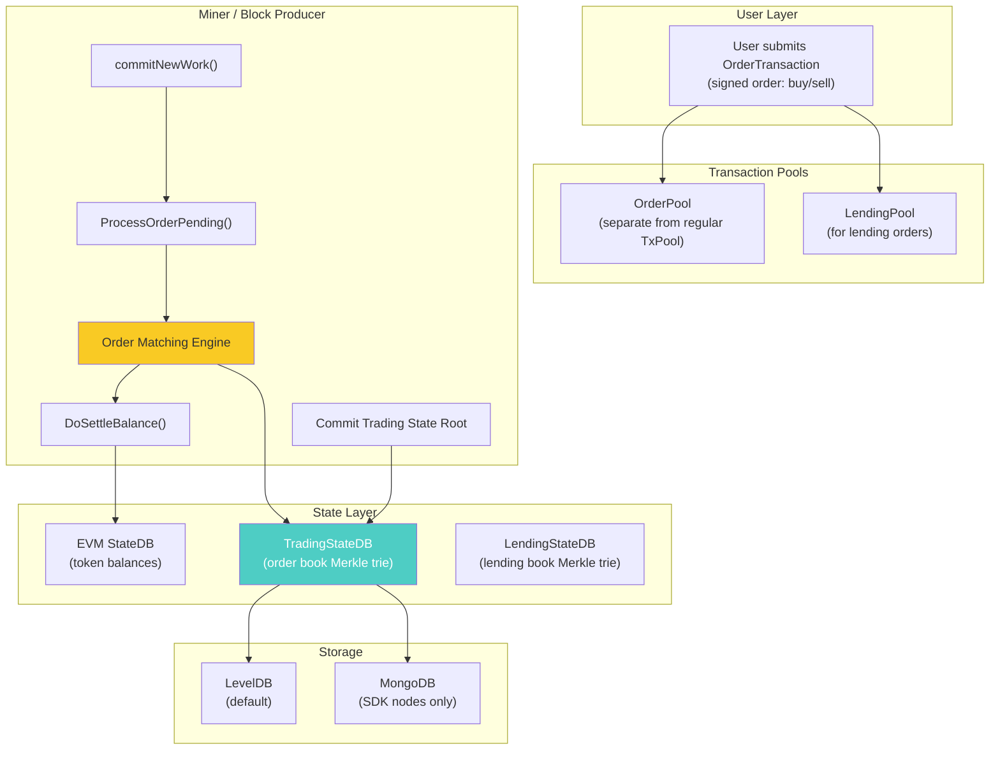
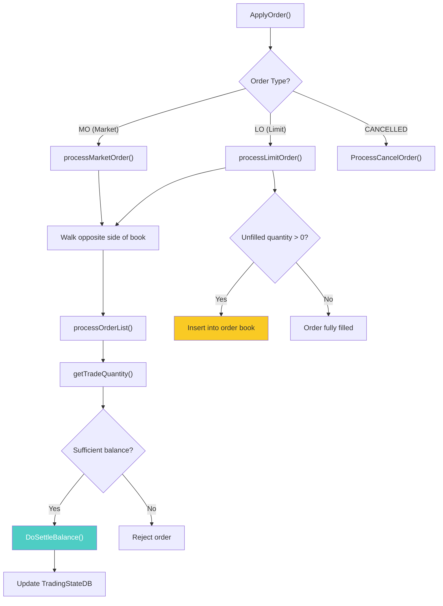
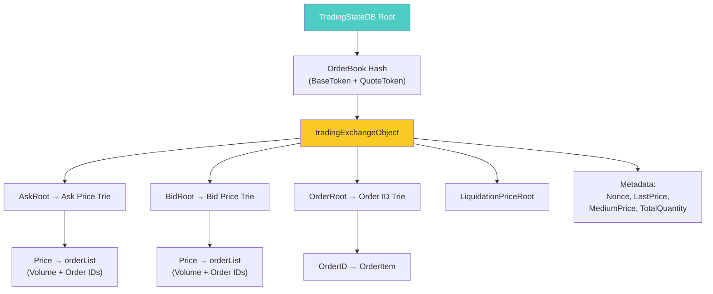
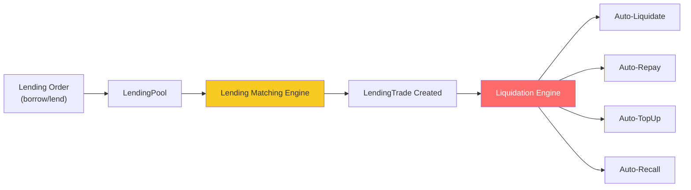

# TomoX Deep Dive: Victionchain's On-Chain DEX Protocol

## What is TomoX?

TomoX is a **protocol-level decentralized exchange (DEX)** built directly into the Viction blockchain (formerly TomoChain). Unlike typical DEXs that run as smart contracts on top of a blockchain, TomoX is integrated into the **consensus layer** itself — masternodes perform order matching during block production, and trades are settled by directly modifying EVM state (token balances).

> [!IMPORTANT]
> TomoX is not a smart contract DEX. It's an **extension of the blockchain protocol** — order matching happens inside the miner/block-producer code, not in the EVM.

---

## Architecture Overview



---

## Order Lifecycle (Full Workflow)

### Step 1: Order Submission

Users sign an `OrderTransaction` containing:

| Field | Description |
|---|---|
| `UserAddress` | Trader's wallet address |
| `ExchangeAddress` | Relayer address (must be a registered relayer) |
| `BaseToken` | Token being traded |
| `QuoteToken` | Token used as price denomination |
| [Price](file:///Users/endadinh/Documents/viction-monorepo/victionchain/tomox/tradingstate/orderitem.go#289-297) | Order price (for limit orders) |
| [Quantity](file:///Users/endadinh/Documents/viction-monorepo/victionchain/tomox/tradingstate/orderitem.go#298-306) | Order amount |
| [Side](file:///Users/endadinh/Documents/viction-monorepo/victionchain/tomox/tradingstate/orderitem.go#282-288) | `BUY` or `SELL` |
| [Type](file:///Users/endadinh/Documents/viction-monorepo/victionchain/tomox/tradingstate/orderitem.go#263-271) | `LO` (limit) or [MO](file:///Users/endadinh/Documents/viction-monorepo/victionchain/contracts/tomox/tomoxListing.go#9-13) (market) |
| [Status](file:///Users/endadinh/Documents/viction-monorepo/victionchain/tomox/tradingstate/orderitem.go#307-315) | `NEW` or `CANCELLED` |
| [Nonce](file:///Users/endadinh/Documents/viction-monorepo/victionchain/tomox/tradingstate/statedb.go#141-151) | Order nonce (separate from ETH nonce) |
| [Signature](file:///Users/endadinh/Documents/viction-monorepo/victionchain/tomox/tradingstate/orderitem.go#49-54) | EIP-712 style signature |

Source: [tradingstate/orderitem.go:27-46](file:///Users/endadinh/Documents/viction-monorepo/victionchain/tomox/tradingstate/orderitem.go#L27-L46)

### Step 2: Order Pool

Order transactions enter a separate `OrderPool` (not the regular [TxPool](file:///Users/endadinh/Documents/viction-monorepo/victionchain/cmd/utils/flags.go#974-1006)). This is retrieved during block production:

```go
// miner/worker.go:699
tradingOrderPending, _ := self.eth.OrderPool().Pending()
```

### Step 3: Order Matching (During Block Production)

When a masternode produces a block, it calls [ProcessOrderPending()](file:///Users/endadinh/Documents/viction-monorepo/victionchain/tomoxlending/tomoxlending.go#103-201) inside [commitNewWork()](file:///Users/endadinh/Documents/viction-monorepo/victionchain/miner/worker.go#529-851):

```go
// miner/worker.go:701
tradingTxMatches, tradingMatchingResults = tomoX.ProcessOrderPending(
    header, self.coinbase, self.chain, tradingOrderPending,
    work.state, work.tradingState,
)
```

Source: [miner/worker.go:684-714](file:///Users/endadinh/Documents/viction-monorepo/victionchain/miner/worker.go#L684-L714)

### Step 4: Matching Engine

The matching engine processes each order through:



**Limit Order Matching** ([order_processor.go:150-208](file:///Users/endadinh/Documents/viction-monorepo/victionchain/tomox/order_processor.go#L150-L208)):
- BUY: iterates ask side from [GetBestAskPrice()](file:///Users/endadinh/Documents/viction-monorepo/victionchain/tomox/tradingstate/statedb.go#355-371) upward while `price >= askPrice`
- SELL: iterates bid side from [GetBestBidPrice()](file:///Users/endadinh/Documents/viction-monorepo/victionchain/tomox/tradingstate/statedb.go#372-388) downward while `price <= bidPrice`
- Unmatched remainder is inserted into the order book trie

**Market Order Matching** ([order_processor.go:107-148](file:///Users/endadinh/Documents/viction-monorepo/victionchain/tomox/order_processor.go#L107-L148)):
- Walks the opposite side of the book until `quantityToTrade = 0` or no more orders

### Step 5: Balance Settlement

[DoSettleBalance()](file:///Users/endadinh/Documents/viction-monorepo/victionchain/tomox/order_processor.go#517-610) ([order_processor.go:517-609](file:///Users/endadinh/Documents/viction-monorepo/victionchain/tomox/order_processor.go#L517-L609)) modifies EVM state directly:

| Transfer | Description |
|---|---|
| Taker receives `InToken` | Base token (for BUY) or quote token (for SELL) |
| Taker sends `OutToken` | Quote token (for BUY) or base token (for SELL) |
| Maker receives/sends | Inverse of taker |
| Taker fee → Relayer owner | Fee in quote token |
| Maker fee → Relayer owner | Fee in quote token |
| RelayerFee → Masternode | 0.001 TOMO per match (from relayer deposit) |

### Step 6: State Root Commit

After all matches, the trading state root is committed as a special transaction:

```go
// miner/worker.go:801-810
TomoxStateRoot := work.tradingState.IntermediateRoot()
LendingStateRoot := work.lendingState.IntermediateRoot()
txData := append(TomoxStateRoot.Bytes(), LendingStateRoot.Bytes()...)
tx := types.NewTransaction(nonce, common.HexToAddress(common.TradingStateAddr), ...)
```

This transaction is sent to address `0x0000000000000000000000000000000000000092` (`TradingStateAddr`), embedding both the trading and lending state roots.

---

## Trading State (Order Book) Architecture

The order book is stored in a **parallel Merkle Patricia Trie**, separate from the main EVM state:



Source: [tradingstate/common.go:69-80](file:///Users/endadinh/Documents/viction-monorepo/victionchain/tomox/tradingstate/common.go#L69-L80)

The order book hash is computed from base and quote token addresses:
```go
// tradingstate/common.go:213-215
func GetTradingOrderBookHash(baseToken, quoteToken common.Address) common.Hash {
    return common.BytesToHash(append(baseToken[:16], quoteToken[4:]...))
}
```

---

## Fee System

### Trading Fees

| Constant | Value | Description |
|---|---|---|
| `TomoXBaseFee` | 10,000 | Fee denominator (fee rate out of 10,000) |
| `RelayerFee` | 0.001 TOMO | Per-match fee paid by relayer to masternode |
| `RelayerCancelFee` | 0.001 TOMO | Per-cancel fee |

Source: [common/constants.go:52-57](file:///Users/endadinh/Documents/viction-monorepo/victionchain/common/constants.go#L52-L57)

**Fee flow per trade:**
1. **Taker** pays `quantity × price × takerFeeRate / 10000` in quote token → taker's relayer owner
2. **Maker** pays `quantity × price × makerFeeRate / 10000` in quote token → maker's relayer owner  
3. **Both relayers** each pay `0.001 TOMO` from their deposit → block producer (masternode owner)

### Cancellation Fees

Two versions exist, gated by `TIPTomoXCancellationFee` hardfork:
- **V1** ([order_processor.go:686-709](file:///Users/endadinh/Documents/viction-monorepo/victionchain/tomox/order_processor.go#L686-L709)): `1/10 × tradingFee` (deprecated)
- **V2** ([order_processor.go:711-728](file:///Users/endadinh/Documents/viction-monorepo/victionchain/tomox/order_processor.go#L711-L728)): Converts `RelayerCancelFee` (TOMO) to equivalent token amount using epoch average price

---

## Relayer System

Relayers are intermediaries that host order book UIs. They must:

1. **Register** via the relayer smart contract (deposit TOMO)
2. **List trading pairs** (base/quote token combinations)
3. **Set fee rates** (stored in contract state)
4. **Maintain deposit** — deducted per trade for masternode rewards

Relayer validation:
```go
// tradingstate/orderitem.go:234-240
func (o *OrderItem) verifyRelayer(state *state.StateDB) error {
    if !IsValidRelayer(state, o.ExchangeAddress) {
        return ErrInvalidRelayer
    }
    return nil
}
```

---

## Order Verification Pipeline

Before matching, each order is verified ([orderitem.go:190-232](file:///Users/endadinh/Documents/viction-monorepo/victionchain/tomox/tradingstate/orderitem.go#L190-L232)):

1. **Relayer validation** — is `ExchangeAddress` a registered relayer?
2. **Signature verification** — does the signature match `UserAddress`?
3. **Pair verification** — is `BaseToken/QuoteToken` listed on this relayer?
4. **Order type** — only `LO` (limit) and [MO](file:///Users/endadinh/Documents/viction-monorepo/victionchain/contracts/tomox/tomoxListing.go#9-13) (market) supported
5. **Side** — only `BUY` and `SELL`
6. **Price validity** — must be positive (non-zero for limit)
7. **Quantity validity** — must be positive
8. **Balance check** — user has enough tokens

---

## Precompiled Contracts (EVM Integration)

TomoX exposes price data to smart contracts via two **precompiled contracts** ([core/vm/tomox_price.go](file:///Users/endadinh/Documents/viction-monorepo/victionchain/core/vm/tomox_price.go)):

| Precompile | Input | Output |
|---|---|---|
| [tomoxLastPrice](file:///Users/endadinh/Documents/viction-monorepo/victionchain/core/vm/tomox_price.go#12-15) | `baseToken + quoteToken` (64 bytes) | Last traded price (32 bytes) |
| [tomoxEpochPrice](file:///Users/endadinh/Documents/viction-monorepo/victionchain/core/vm/tomox_price.go#15-18) | `baseToken + quoteToken` (64 bytes) | Average price in last epoch (32 bytes) |

This allows smart contracts to query DEX prices on-chain, useful for oracles and DeFi.

---

## TomoX Lending Extension

The `tomoxlending/` package extends TomoX with **collateralized lending**:



Key features:
- **Separate LendingStateDB** — another parallel Merkle trie for lending books
- **Interest rate matching** — lenders and borrowers matched by interest rate
- **Collateral management** — borrowers lock collateral tokens
- **Liquidation processing** ([tomoxlending.go:830-954](file:///Users/endadinh/Documents/viction-monorepo/victionchain/tomoxlending/tomoxlending.go#L830-L954)): Runs at specific block numbers within each epoch (`LiquidateLendingTradeBlock`)
- **Auto-repay, auto-topup, auto-recall** — automated position management
- Depends on TomoX trading prices for collateral valuation

---

## Data Storage (DAO Layer)

The `tomoxDAO/` package provides two backends:

| Backend | Usage | Files |
|---|---|---|
| **LevelDB** | Default for all nodes, stores order book state | [tomoxDAO/leveldb.go](file:///Users/endadinh/Documents/viction-monorepo/victionchain/tomoxDAO/leveldb.go) |
| **MongoDB** | SDK nodes only, stores orders/trades for APIs | [tomoxDAO/mongodb.go](file:///Users/endadinh/Documents/viction-monorepo/victionchain/tomoxDAO/mongodb.go) |

SDK nodes (`DBEngine = "mongodb"`) sync trade data to MongoDB via [SyncDataToSDKNode()](file:///Users/endadinh/Documents/viction-monorepo/victionchain/tomox/tomox.go#312-564) ([tomox.go:317-563](file:///Users/endadinh/Documents/viction-monorepo/victionchain/tomox/tomox.go#L317-L563)), enabling rich query APIs for frontends.

---

## Smart Contracts

| Contract | Purpose |
|---|---|
| **TOMOXListing** | Token listing/registration for trading pairs |
| **Registration** | Relayer registration and deposit management |
| **TRC21** | Token standard with fee-on-transfer support |

Source: [contracts/tomox/](file:///Users/endadinh/Documents/viction-monorepo/victionchain/contracts/tomox/)

---

## Hardfork-Gated Features

TomoX features are enabled/disabled via chain config hardforks:

| Config Check | Feature |
|---|---|
| `IsTomoXEnabled(blockNumber)` | TomoX trading enabled at all |
| `IsTomoXCancellationFeeEnabled(num)` | New cancellation fee model (V2) |
| `IsTomoZEnabled(blockNumber)` | TomoZ token fee protocol |

Source: [params/config.go:382](file:///Users/endadinh/Documents/viction-monorepo/victionchain/params/config.go#L382)

---

## Deprecation Status

> [!NOTE]
> TomoX is **still present in the codebase** and integrated into the consensus layer. It is not removed or flagged as deprecated in the code. However, the feature was designed for the original TomoChain and its active usage/maintenance status should be verified with the team.

Evidence of continued integration:
- [miner/worker.go](file:///Users/endadinh/Documents/viction-monorepo/victionchain/miner/worker.go) still calls [ProcessOrderPending()](file:///Users/endadinh/Documents/viction-monorepo/victionchain/tomoxlending/tomoxlending.go#103-201) during block production
- Trading state roots are committed to blocks
- Precompiled price contracts are still registered
- The lending module depends on trading state for price feeds

---

## Special Addresses

| Address | Purpose |
|---|---|
| `0x0000000000000000000000000000000000000092` | `TradingStateAddr` — trading/lending state root storage |
| `TomoXAddr` | Match batch transaction target |
| `TomoXLendingAddress` | Lending transaction target |
| `TomoXLendingFinalizedTradeAddress` | Liquidation finalization target |

---

## File Reference Map

| File | Lines | Role |
|---|---|---|
| [tomox/tomox.go](file:///Users/endadinh/Documents/viction-monorepo/victionchain/tomox/tomox.go) | 669 | Core TomoX service, order processing, SDK sync |
| [tomox/order_processor.go](file:///Users/endadinh/Documents/viction-monorepo/victionchain/tomox/order_processor.go) | 785 | Matching engine (limit, market, cancel), settlement |
| [tomox/api.go](file:///Users/endadinh/Documents/viction-monorepo/victionchain/tomox/api.go) | — | RPC API (`tomox_version`, etc.) |
| [tomox/tradingstate/statedb.go](file:///Users/endadinh/Documents/viction-monorepo/victionchain/tomox/tradingstate/statedb.go) | 727 | Order book Merkle trie state management |
| [tomox/tradingstate/orderitem.go](file:///Users/endadinh/Documents/viction-monorepo/victionchain/tomox/tradingstate/orderitem.go) | 416 | Order data structure, verification, serialization |
| [tomox/tradingstate/common.go](file:///Users/endadinh/Documents/viction-monorepo/victionchain/tomox/tradingstate/common.go) | 220 | Constants, data types, utility functions |
| [tomoxlending/tomoxlending.go](file:///Users/endadinh/Documents/viction-monorepo/victionchain/tomoxlending/tomoxlending.go) | 955 | Lending protocol with liquidation |
| [tomoxDAO/](file:///Users/endadinh/Documents/viction-monorepo/victionchain/tomoxDAO/) | — | LevelDB + MongoDB backends |
| [miner/worker.go](file:///Users/endadinh/Documents/viction-monorepo/victionchain/miner/worker.go) | 1140 | Consensus integration (calls matching during block production) |
| [core/vm/tomox_price.go](file:///Users/endadinh/Documents/viction-monorepo/victionchain/core/vm/tomox_price.go) | 72 | EVM precompiled contracts for price queries |
| [contracts/tomox/](file:///Users/endadinh/Documents/viction-monorepo/victionchain/contracts/tomox/) | — | Smart contracts (listing, registration) |
| [common/constants.go](file:///Users/endadinh/Documents/viction-monorepo/victionchain/common/constants.go) | — | Fee constants (RelayerFee, TomoXBaseFee) |
