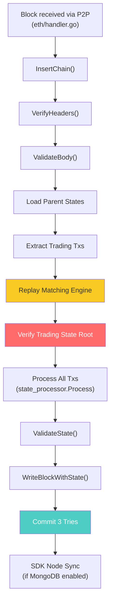
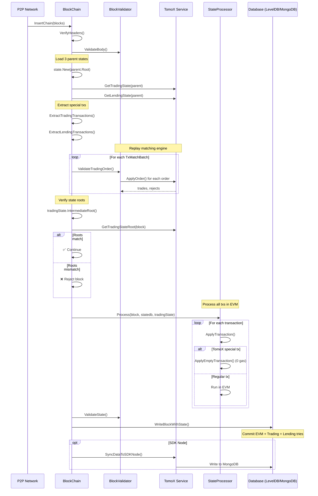

# TomoX Transaction Syncing: What Happens When a Node Syncs a Block

## Overview

When a syncing (non-mining) node receives a block containing TomoX transactions, it must **independently replay the entire matching engine** to verify the block producer's results. This document traces every step of that process.

> [!IMPORTANT]
> Syncing nodes don't trust the block producer's matching results. They **re-execute** the matching engine deterministically and verify the resulting state root matches what's embedded in the block.

---

## Block Structure: What's Inside a TomoX Block

A block with TomoX activity contains up to **4 special transaction types** alongside regular transactions:

| Transaction Type | Target Address | Detection Method | Purpose |
|---|---|---|---|
| **Trading Match Tx** | `TomoXAddr` | `tx.IsTradingTransaction()` | Contains serialized matched orders |
| **Lending Tx** | `TomoXLendingAddress` | `tx.IsLendingTransaction()` | Contains lending order matches |
| **Lending Finalized Tx** | `TomoXLendingFinalizedTradeAddress` | `tx.IsLendingFinalizedTradeTransaction()` | Liquidation results |
| **State Root Tx** | `TradingStateAddr` (`0x...0092`) | `tx.To() == TradingStateAddr` | Trading + Lending state roots |

All special transactions use **zero gas** and are processed via [ApplyEmptyTransaction()](file:///Users/endadinh/Documents/viction-monorepo/victionchain/core/state_processor.go#531-554).

---

## Full Syncing Pipeline



---

## Step-by-Step Breakdown

### Step 1: Block Reception

Blocks arrive via the P2P network and enter [InsertChain()](file:///Users/endadinh/Documents/viction-monorepo/victionchain/core/blockchain.go#1422-1433):

```go
// core/blockchain.go:1428
func (bc *BlockChain) InsertChain(chain types.Blocks) (int, error) {
    n, events, logs, err := bc.insertChain(chain)
    ...
}
```

### Step 2: Header & Body Validation

The consensus engine verifies headers in parallel, then body validation runs:

```go
// core/blockchain.go:1476
abort, results := bc.engine.VerifyHeaders(bc, headers, seals)

// core/blockchain.go:1496
err = bc.Validator().ValidateBody(block)
```

[ValidateBody()](file:///Users/endadinh/Documents/viction-monorepo/victionchain/core/block_validator.go#52-79) checks:
- Block isn't already known
- Parent exists with full state
- Transaction root hash matches
- Uncle hash matches

Source: [block_validator.go:55-78](file:///Users/endadinh/Documents/viction-monorepo/victionchain/core/block_validator.go#L55-L78)

### Step 3: Load Parent States (3 State Databases)

The node loads **three** separate state databases from the parent block:

```go
// core/blockchain.go:1569 — EVM State
statedb, err := state.New(parent.Root(), bc.stateCache)

// core/blockchain.go:1595 — Trading State
tradingState, err = tradingService.GetTradingState(parent, parentAuthor)

// core/blockchain.go:1600 — Lending State
lendingState, err = lendingService.GetLendingState(parent, parentAuthor)
```

Source: [blockchain.go:1569-1604](file:///Users/endadinh/Documents/viction-monorepo/victionchain/core/blockchain.go#L1569-L1604)

### Step 4: Extract Trading Transactions

Special trading transactions are extracted from the block and decoded:

```go
// core/blockchain.go:1590
txMatchBatchData, err := ExtractTradingTransactions(block.Transactions())
```

[ExtractTradingTransactions()](file:///Users/endadinh/Documents/viction-monorepo/victionchain/core/block_validator.go#210-225) iterates all transactions, filters those where `tx.IsTradingTransaction() == true`, and decodes their data payload into [TxMatchBatch](file:///Users/endadinh/Documents/viction-monorepo/victionchain/tomox/tradingstate/common.go#111-116) structs:

```go
// core/block_validator.go:210-224
func ExtractTradingTransactions(transactions types.Transactions) ([]tradingstate.TxMatchBatch, error) {
    for _, tx := range transactions {
        if tx.IsTradingTransaction() {
            txMatchBatch, err := tradingstate.DecodeTxMatchesBatch(tx.Data())
            // ... decode JSON payload into TxMatchBatch
            txMatchBatch.TxHash = tx.Hash()
            txMatchBatchData = append(txMatchBatchData, txMatchBatch)
        }
    }
    return txMatchBatchData, nil
}
```

Each [TxMatchBatch](file:///Users/endadinh/Documents/viction-monorepo/victionchain/tomox/tradingstate/common.go#111-116) contains multiple [TxDataMatch](file:///Users/endadinh/Documents/viction-monorepo/victionchain/tomox/tradingstate/common.go#107-110) entries — each is a serialized [OrderItem](file:///Users/endadinh/Documents/viction-monorepo/victionchain/tomox/tradingstate/orderitem.go#27-47) that the block producer originally matched.

### Step 5: Replay the Matching Engine (Deterministic Verification)

> [!CAUTION]
> This is the **critical validation step**. The syncing node replays every order through the matching engine to independently compute what the trading state should be.

```go
// core/blockchain.go:1610-1617
for _, txMatchBatch := range txMatchBatchData {
    err := bc.Validator().ValidateTradingOrder(
        statedb, tradingState, txMatchBatch, author, block.Header(),
    )
}
```

[ValidateTradingOrder()](file:///Users/endadinh/Documents/viction-monorepo/victionchain/core/block_validator.go#108-143) does the following for each match batch:

```go
// core/block_validator.go:108-142
func (v *BlockValidator) ValidateTradingOrder(...) error {
    for _, txMatch := range txMatchBatch.Data {
        // 1. Decode the order from the tx data
        order, err := txMatch.DecodeOrder()

        // 2. Re-run the FULL matching engine
        newTrades, newRejectedOrders, err := tomoXService.ApplyOrder(
            header, coinbase, v.bc, statedb, tomoxStatedb,
            tradingstate.GetTradingOrderBookHash(order.BaseToken, order.QuoteToken),
            order,
        )

        // 3. Cache results for SDK nodes
        tradingResult[key] = tradingstate.MatchingResult{
            Trades:  newTrades,
            Rejects: newRejectedOrders,
        }
    }
}
```

**This calls exactly the same [ApplyOrder()](file:///Users/endadinh/Documents/viction-monorepo/victionchain/tomox/order_processor.go#33-106) function that the block producer used.** Because it's deterministic (same input state + same orders = same output), the resulting trading state must be identical.

The same process runs for lending:

```go
// core/blockchain.go:1619-1631
batches, _ := ExtractLendingTransactions(block.Transactions())
for _, batch := range batches {
    err := bc.Validator().ValidateLendingOrder(
        statedb, lendingState, tradingState, batch, author, block.Header(),
    )
}
```

### Step 6: Epoch Price Update

At epoch boundaries (block number % epoch == 0), the node updates the medium price:

```go
// core/blockchain.go:1605-1608
if (block.NumberU64() % bc.chainConfig.Posv.Epoch) == 0 {
    tradingService.UpdateMediumPriceBeforeEpoch(
        block.NumberU64()/bc.chainConfig.Posv.Epoch, tradingState, statedb,
    )
}
```

### Step 7: Lending Liquidation Processing

At the designated liquidation block within each epoch:

```go
// core/blockchain.go:1633-1646
if block.Number().Uint64()%bc.chainConfig.Posv.Epoch == common.LiquidateLendingTradeBlock {
    finalizedTrades, _, _, _, _, err = lendingService.ProcessLiquidationData(
        block.Header(), bc, statedb, tradingState, lendingState,
    )
}
```

### Step 8: Verify Trading State Root ⚠️

After replaying all matches, the node computes the resulting state root and compares it against the root embedded in the block:

```go
// core/blockchain.go:1649-1670
// Verify Trading State Root
gotRoot := tradingState.IntermediateRoot()
expectRoot, _ := tradingService.GetTradingStateRoot(block, author)
if gotRoot != expectRoot {
    err = fmt.Errorf(
        "invalid tomox trading state merke trie got: %s, expect: %s",
        gotRoot.Hex(), expectRoot.Hex(),
    )
    // BLOCK IS REJECTED
}

// Verify Lending State Root
gotRoot = lendingState.IntermediateRoot()
expectRoot, _ = lendingService.GetLendingStateRoot(block, author)
if gotRoot != expectRoot {
    err = fmt.Errorf(
        "invalid lending state merke trie got: %s, expect: %s",
        gotRoot.Hex(), expectRoot.Hex(),
    )
    // BLOCK IS REJECTED
}
```

> [!WARNING]
> If the roots don't match, the block is **rejected** — the block producer cheated or there's a consensus bug. `bc.reportBlock()` is called to log the invalid block.

### Step 9: Process All Transactions (EVM)

Now the regular transaction processing runs via `state_processor.Process()`:

```go
// core/blockchain.go:1680
receipts, logs, usedGas, err := bc.processor.Process(
    block, statedb, tradingState, bc.vmConfig, feeCapacity,
)
```

Inside [Process()](file:///Users/endadinh/Documents/viction-monorepo/victionchain/core/state_processor.go#62-157), each transaction is applied. When [ApplyTransaction()](file:///Users/endadinh/Documents/viction-monorepo/victionchain/core/state_processor.go#260-495) encounters a TomoX special transaction, it takes a **shortcut**:

```go
// core/state_processor.go:268-280
// State root tx → empty receipt, zero gas
if tx.To().String() == common.TradingStateAddr {
    return ApplyEmptyTransaction(config, statedb, header, tx, usedGas)
}
// Lending tx → empty receipt, zero gas
if tx.To().String() == common.TomoXLendingAddress {
    return ApplyEmptyTransaction(config, statedb, header, tx, usedGas)
}
// Trading match tx → empty receipt, zero gas
if tx.IsTradingTransaction() {
    return ApplyEmptyTransaction(config, statedb, header, tx, usedGas)
}
```

[ApplyEmptyTransaction()](file:///Users/endadinh/Documents/viction-monorepo/victionchain/core/state_processor.go#531-554) creates a receipt with **0 gas used** and a minimal log entry — the actual work was already done in Step 5.

Source: [state_processor.go:531-553](file:///Users/endadinh/Documents/viction-monorepo/victionchain/core/state_processor.go#L531-L553)

### Step 10: Validate EVM State

Standard Ethereum state validation runs:

```go
// core/blockchain.go:1687
err = bc.Validator().ValidateState(block, parent, statedb, receipts, usedGas)
```

This verifies:
- Gas used matches the block header
- Receipt bloom matches
- Receipt root hash matches
- **EVM state root matches `header.Root`**

Source: [block_validator.go:84-106](file:///Users/endadinh/Documents/viction-monorepo/victionchain/core/block_validator.go#L84-L106)

### Step 11: Commit All Three State Tries

[WriteBlockWithState()](file:///Users/endadinh/Documents/viction-monorepo/victionchain/core/blockchain.go#1202-1421) commits everything to the database:

```go
// core/blockchain.go:1229-1246
// Commit EVM state
root, err := state.Commit(bc.chainConfig.IsEIP158(block.Number()))

// Commit Trading state
if tradingState != nil {
    tradingRoot, err = tradingState.Commit()
}

// Commit Lending state
if lendingState != nil {
    lendingRoot, err = lendingState.Commit()
}
```

The tries are then persisted to disk/memory with garbage collection:

```go
// core/blockchain.go:1264-1370
// Archive node: flush immediately
triedb.Commit(root, false)
tradingTrieDb.Commit(tradingRoot, false)
lendingTrieDb.Commit(lendingRoot, false)

// Full node: reference counting + periodic flush
triedb.Reference(root, common.Hash{})
bc.triegc.Push(root, -float32(block.NumberU64()))
tradingTrieDb.Reference(tradingRoot, common.Hash{})
tradingService.GetTriegc().Push(tradingRoot, ...)
```

Source: [blockchain.go:1229-1370](file:///Users/endadinh/Documents/viction-monorepo/victionchain/core/blockchain.go#L1229-L1370)

### Step 12: SDK Node Data Sync (MongoDB)

After successful insertion, SDK nodes sync trade data to MongoDB:

```go
// core/blockchain.go:1747-1750
if bc.chainConfig.IsTomoXEnabled(block.Number()) {
    bc.logExchangeData(block)
    bc.logLendingData(block)
}
```

[logExchangeData()](file:///Users/endadinh/Documents/viction-monorepo/victionchain/core/blockchain.go#2610-2673) retrieves cached matching results and calls [SyncDataToSDKNode()](file:///Users/endadinh/Documents/viction-monorepo/victionchain/tomoxlending/tomoxlending.go#202-478):

```go
// core/blockchain.go:2610-2672
func (bc *BlockChain) logExchangeData(block *types.Block) {
    // Only for SDK nodes
    if !tomoXService.IsSDKNode() { return }

    // Extract trading txs from block
    txMatchBatchData, _ := ExtractTradingTransactions(block.Transactions())

    for _, txMatchBatch := range txMatchBatchData {
        for _, txMatch := range txMatchBatch.Data {
            // Get cached trades (from Step 5 replay)
            trades := bc.resultTrade.Get(cacheKey)
            rejectedOrders := bc.rejectedOrders.Get(cacheKey)

            // Sync to MongoDB
            tomoXService.SyncDataToSDKNode(
                takerOrderInTx, txMatchBatch.TxHash, txMatchTime,
                currentState, trades, rejectedOrders, &dirtyOrderCount,
            )
        }
    }
}
```

---

## Processing Flow Diagram



---

## Chain Reorganization with TomoX

When a chain reorg occurs, TomoX state must also be rolled back:

```go
// core/blockchain.go:2674
func (bc *BlockChain) reorgTxMatches(deletedTxs types.Transactions, newChain types.Blocks) {
    // For each deleted block's trading txs:
    //   Roll back matching results
    //   Call RollbackReorgTxMatch() on SDK nodes
    // For each new block:
    //   Re-sync exchange data
    //   Re-sync lending data
}
```

The [RollbackReorgTxMatch()](file:///Users/endadinh/Documents/viction-monorepo/victionchain/tomox/tomox.go#627-669) function in [tomox.go](file:///Users/endadinh/Documents/viction-monorepo/victionchain/tomox/tomox.go) reverses order status changes and trade records in MongoDB.

---

## Key Difference: Mining Node vs Syncing Node

| Aspect | Mining Node | Syncing Node |
|---|---|---|
| **Order source** | `OrderPool.Pending()` | Decoded from block tx data |
| **Matching trigger** | [ProcessOrderPending()](file:///Users/endadinh/Documents/viction-monorepo/victionchain/tomoxlending/tomoxlending.go#103-201) | [ValidateTradingOrder()](file:///Users/endadinh/Documents/viction-monorepo/victionchain/core/block_validator.go#108-143) |
| **State root** | Computed and embedded in block | Computed and compared against block |
| **If root mismatch** | N/A (produces the block) | Block rejected |
| **Trading tx creation** | Creates and signs match tx | Verifies existing match tx |
| **Gas for TomoX txs** | 0 (set by miner) | 0 (verified by [ApplyEmptyTransaction](file:///Users/endadinh/Documents/viction-monorepo/victionchain/core/state_processor.go#531-554)) |
| **SDK sync** | [AddMatchingResult()](file:///Users/endadinh/Documents/viction-monorepo/victionchain/core/blockchain.go#2785-2792) cache | [logExchangeData()](file:///Users/endadinh/Documents/viction-monorepo/victionchain/core/blockchain.go#2610-2673) after insertion |

---

## File Reference Map

| File | Key Functions | Role |
|---|---|---|
| [blockchain.go](file:///Users/endadinh/Documents/viction-monorepo/victionchain/core/blockchain.go) | [insertChain()](file:///Users/endadinh/Documents/viction-monorepo/victionchain/core/blockchain.go#1434-1785) (L1437), [WriteBlockWithState()](file:///Users/endadinh/Documents/viction-monorepo/victionchain/core/blockchain.go#1202-1421) (L1203), [logExchangeData()](file:///Users/endadinh/Documents/viction-monorepo/victionchain/core/blockchain.go#2610-2673) (L2610) | Main syncing path, state commit, SDK sync |
| [block_validator.go](file:///Users/endadinh/Documents/viction-monorepo/victionchain/core/block_validator.go) | [ValidateTradingOrder()](file:///Users/endadinh/Documents/viction-monorepo/victionchain/core/block_validator.go#108-143) (L108), [ExtractTradingTransactions()](file:///Users/endadinh/Documents/viction-monorepo/victionchain/core/block_validator.go#210-225) (L210) | Matching engine replay & tx extraction |
| [state_processor.go](file:///Users/endadinh/Documents/viction-monorepo/victionchain/core/state_processor.go) | [Process()](file:///Users/endadinh/Documents/viction-monorepo/victionchain/core/state_processor.go#62-157) (L69), [ApplyTransaction()](file:///Users/endadinh/Documents/viction-monorepo/victionchain/core/state_processor.go#260-495) (L264), [ApplyEmptyTransaction()](file:///Users/endadinh/Documents/viction-monorepo/victionchain/core/state_processor.go#531-554) (L531) | Transaction execution, special tx routing |
| [tomox/tomox.go](file:///Users/endadinh/Documents/viction-monorepo/victionchain/tomox/tomox.go) | [GetTradingState()](file:///Users/endadinh/Documents/viction-monorepo/victionchain/tomox/tomox.go#565-575), [SyncDataToSDKNode()](file:///Users/endadinh/Documents/viction-monorepo/victionchain/tomoxlending/tomoxlending.go#202-478), [RollbackReorgTxMatch()](file:///Users/endadinh/Documents/viction-monorepo/victionchain/tomox/tomox.go#627-669) | State loading, SDK sync, reorg handling |
| [tomox/order_processor.go](file:///Users/endadinh/Documents/viction-monorepo/victionchain/tomox/order_processor.go) | [ApplyOrder()](file:///Users/endadinh/Documents/viction-monorepo/victionchain/tomox/order_processor.go#33-106), [DoSettleBalance()](file:///Users/endadinh/Documents/viction-monorepo/victionchain/tomox/order_processor.go#517-610) | Matching engine (same code for both mining and syncing) |
